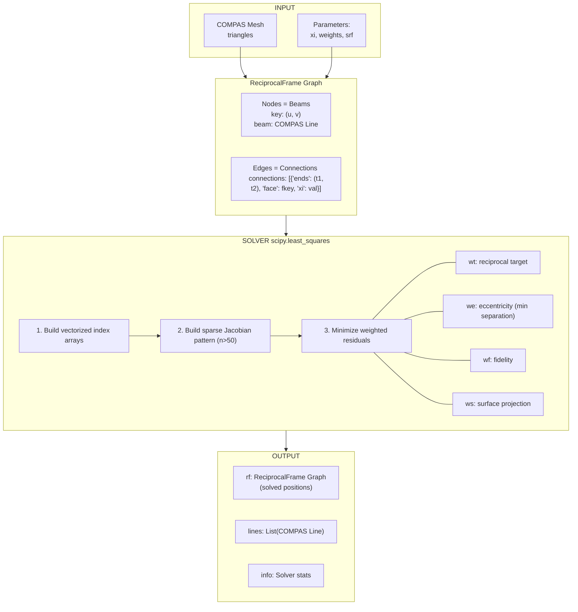
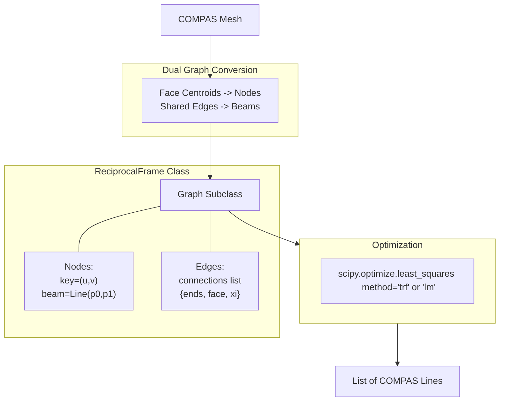

# Reciprocal Frame Solver

A COMPAS-based solver for generating reciprocal frame structures from triangulated meshes.

Based on and inspired by the **Future tree** and the algorithms by Aleksandra Anna Apolinarska (ETH Zurich).

## Architecture



## Data Flow Diagram



## Mathematical Foundation

### 1. The Engagement Parameter (ξ)

The key parameter `xi` (ξ) controls where beam endpoints land on their supporting beams:

**Target point formula:**

$$\mathbf{t}_{ij} = \mathbf{p}_j^{ref} + \frac{\xi}{2} \cdot (\mathbf{p}_j^{other} - \mathbf{p}_j^{ref})$$

Where:
- $\mathbf{p}_j^{ref}$ = reference endpoint of beam j (the closer one)
- $\mathbf{p}_j^{other}$ = the other endpoint of beam j
- $\xi \in [0, 1]$ 

### 2. Optimization Problem

We solve a nonlinear least-squares problem to find beam positions that satisfy reciprocal constraints:

$$\min_{\mathbf{x}} \sum_{k} r_k(\mathbf{x})^2$$

Where $\mathbf{x}$ is the flattened vector of all beam endpoint coordinates:

$$\mathbf{x} = [x_0^{(1)}, y_0^{(1)}, z_0^{(1)}, x_1^{(1)}, y_1^{(1)}, z_1^{(1)}, ..., z_1^{(n)}]^T \in \mathbb{R}^{6n}$$

### 3. Residual Functions

#### 3.1 Reciprocal Target (wt) — Primary Constraint

For each connection where beam i's endpoint lands on beam j:

$$\mathbf{r}_{wt} = w_t \cdot (\mathbf{p}_i^{end} - \mathbf{t}_{ij})$$

This generates **3 residuals per connection** (x, y, z components).

**Physical meaning:** Beam endpoints should lie on their supporting beams at the engagement position.

#### 3.2 Eccentricity / Minimum Separation (we)

Prevents beams from intersecting by enforcing minimum distance:

$$r_{we} = w_e \cdot \max(0, d_{min} - \text{dist}(\mathbf{p}, \text{line}_j))$$

Point-to-line distance uses clamped projection:

$$t_{proj} = \text{clamp}\left(\frac{(\mathbf{p} - \mathbf{a}) \cdot (\mathbf{b} - \mathbf{a})}{|\mathbf{b} - \mathbf{a}|^2}, 0, 1\right)$$

$$\text{dist} = |\mathbf{p} - (\mathbf{a} + t_{proj} \cdot (\mathbf{b} - \mathbf{a}))|$$

**1 residual per connection.** Default $d_{min} = 0.03$ (30mm).

#### 3.3 Fidelity (wf) — Regularization

Keeps beams close to their initial dual positions:

$$\mathbf{r}_{wf} = w_f \cdot (\mathbf{x} - \mathbf{x}_0)$$

**6 residuals per beam** (all coordinates). Prevents excessive deformation.

#### 3.4 Surface Constraint (ws)

Projects beam endpoints to a horizontal plane at height $z_{srf}$:

$$r_{ws} = w_s \cdot (z - z_{srf})$$

**2 residuals per beam** (one per endpoint z-coordinate).


## Dependencies

```
compas >= 2.0
scipy >= 1.0
numpy >= 1.20
```

## Files

```
reciprocal_from_mesh/
├── __init__.py          # exports ReciprocalFrame, reciprocal_from_mesh
├── core_graph.py        # main implementation (ReciprocalFrame class)
├── gh_component.py      # Grasshopper wrapper script
└── README.md            # this file
```


## References

1. Apolinarska, A. A. (2018). *Complex Timber Structures from Simple Elements: Computational Design of Novel Bar Structures and Robotic Assembly*. ETH Zurich Dissertation.

2. Song, P., Fu, C. W., Goswami, P., Zheng, J., Mitra, N. J., & Cohen-Or, D. (2013). *Reciprocal Frame Structures Made Easy*. ACM Transactions on Graphics (SIGGRAPH).
